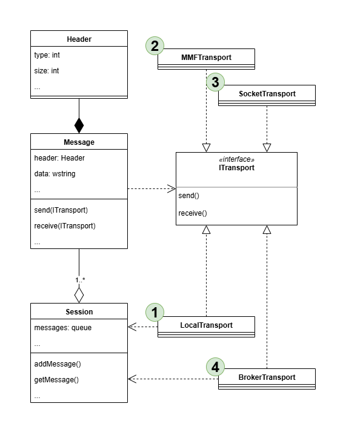

# sysprog.26.labs

# Лабораторные работы по курсу "Системное программирование"

## Примерная диаграмма транспортных классов

## ЛР-1

Реализовать базовое взаимодействие между диалоговым и консольным приложениями.

При нажатии кнопки "Start" диалоговое приложение запускает консольное приложение. Последующие нажатия кнопки "Start" должны привести к созданию в консольном приложении N новых рабочих потоков, где N - значение из поля с числовым счетчиком.  

Нажатие кнопки "Stop" должно привести к закрытию последнего созданного рабочего потока в консольном приложении, а в случае отсутствия рабочих потоков — к его завершению. Консольное приложение также должно завершиться и при завершении диалогового. Диалоговое приложение должно отслеживать, закрыл ли пользователь консольное приложение самостоятельно. Следующее после закрытия консоли нажатие "Start" возобновляет рабочий цикл.

Сразу после запуска консоли в список/выпадающий список должны быть добавлены строки "Все потоки" и "Главный поток". По мере создания новых потоков в него добавляются строки, содержащие их номера. При удалении потоков удаляются и соответствующие им строки. Корректировка списка осуществляется лишь после получения подтверждения от консоли об успешном создании потоков.  

Требования к реализации: 

- взаимодействие между приложениями реализовать с помощью объектов ядра "событие" (event); 

- рабочие потоки создаются с помощью функции CreateThread;

- с каждым рабочим потоком связывается объект "Сессия", содержащий идентификатор сессии, очередь поступающих сообщений (в первой работе обрабатывается только сообщение "Закрыть") и событие для инициации обработки.

- работа с каждой очередью защищается критической секцией либо мьютексом, отправка и получение сообщений из очереди оформляется с помощью паттерна "Стратегия".

## ЛР-2

Добавить в приложения из первой лабораторной работы передачу информации с помощью файла, отображаемого в память (memory mapped file). Реализовать транспортные функции на основе паттерна Стратегия в виде динамически подключаемой библиотеки (C++) с неявной загрузкой в консольное приложение и подключением в диалог с помощью директивы DllImport. Потоковые функции остаются в исполняемом файле.

При нажатии кнопки "Send" диалоговое приложение пересылает консоли текст произвольной длины, введенный в поле ввода. Список/выпадающий список задает поток-адресат. При выборе строки "Все потоки" текст отправляется всем потокам, каждый поток обрабатывает информацию через свою очередь сообщений независимо от других потоков.

Требования к реализации:

- остаются только события для информирования о получении сообщения и подтверждения обработки;

- адресат и тип команды задаются полями в заголовке сообщения;

- "текст произвольной длины" — т.е. не надо резервировать фиксированный буфер в 1kb, 16kb, 2mb и т.п.

- рабочие потоки создаются с помощью класса thread;

- файл, отображаемый в память, защищается от совместного использования с помощью объекта синхронизации mutex;

- передача сообщения адресату "все потоки" производится однократным вызовом транспортной функции;

- полученные тексты доставляются рабочим потокам с помощью сессионных очередей сообщений;

- главный поток выводит полученный текст на стандартный вывод (stdout), рабочие потоки создают текстовые файлы с именами <свой номер>.txt и дописывают в них полученный текст;

- все действия подтверждаются сообщениями от консоли.

## ЛР-3

Реализовать функциональность второй лабораторной работы в условиях запуска диалогового и консольного приложений на различных рабочих станциях локальной сети, добавив транспортную стратегию на основе библиотеки boost.asio. Механизм обработки сессионных сообщений не меняется.

Изменения в реализации:

- события для взаимодействия приложений больше не используются;

- рабочие потоки создаются с помощью класса thread;

- клиент не должен запускать сервер при первом нажатии Start;

- сервер не должен завершаться при выходе клиента либо при закрытии последнего рабочего потока;

- сервер обеспечивает одновременное подключение произвольного количества клиентов, каждый подключившийся клиент получает от сервера количество активных потоков для их адекватного отображения в выпадающем списке. 

- Требование подтверждения всех действий сохраняется.

## ЛР-4

Преобразовать консольное приложение из третьей работы в сервер сообщений, обеспечивающий подключение и взаимодействие диалоговых клиентов.

Изменения в реализации:

- список сессий и обслуживающих их потоков формируется автоматически при подключении очередного клиента и передается всем активным клиентам;

- в диалогах кнопки Start/Stop убираются либо заменяются кнопками Connect/Disconnect;

- отправляемые текстовые сообщения пересылаются выбранным в диалоге адресатам;

- в диалог добавляется текстовое поле либо список, в который выводятся получаемые сообщения;

- если взаимодействие реализовано на основе регулярного опроса сервера сообщений, необходимо обеспечить отключение клиентов по таймауту со времени последнего обращения, хранящемуся в сессии.

## ЛР-5

Реализовать диалоговое и консольное клиентские приложения, взаимодействующие с сервером сообщений из четвертой работы без использования библиотеки с транспортными функциям.

Требования к реализации:

- заменить в диалоговом клиенте вызовы транспортной библиотеки на функции, использующие класс C# Socket;

- реализовать консольные клиентские приложения на Python либо Go. 
